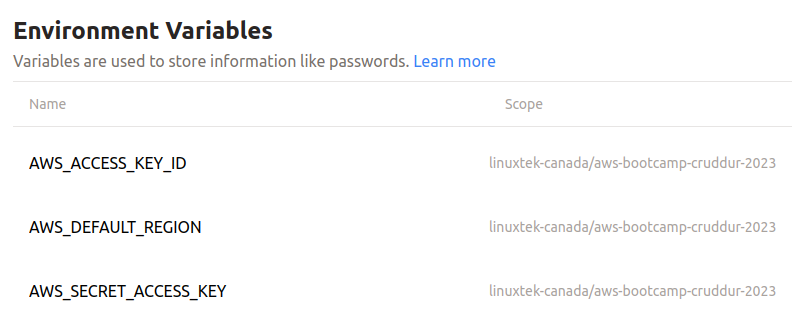

# Week 0 — Billing and Architecture


## Prerequisites
* Created AWS Account for Bootcamp.
* Created Github repo (which you are reading from).
* Set up Gitpod account authorized with Github.  Followed [Gifted Lane's Video](https://www.youtube.com/watch?v=yh9kz9Sh1T8) for setup, and [Andrew Brown's video](https://www.youtube.com/watch?v=A6_c-hJmehs) for the Gitpod button.


## Required Homework

1. Attended Week 0 Live Stream, and the Discord Q&A Session afterwards.
  * Watched follow-up Week 0 -  Generate Credentials, AWS CLI, Budget and Billing Alarm via CLI video.

2. Watched Chirag's Week 0 - Spend Considerations Video.

3. Watched Ashish's Week 0 - Security Considerations Video.
  * I had previously set up an AWS Organization and created the Bootcamp account as a subaccount.  I published [an article](https://www.linuxtek.ca/2023/02/07/aws-cloud-project-boot-camp-week-0-tips-and-tricks/) on this.
  * Activated MFA for root user.
  * Reviewed [blog post](https://aws.amazon.com/blogs/aws-cloud-financial-management/changes-to-aws-billing-cost-management-and-account-consoles-permissions/) for changes to IAM Policies.  Confirmed no affected policies to update.  

  

4.  Created Conceptual Diagram in Lucid Charts AND on a Napkin (for fun)
  
  * So I found this [napkin diagram](../_docs/assets/week0/InvestorNapkinConcept.png) in a bar downtown.  It might have been left by one of the company executives... I think he doodled a bit on it after his meeting.


  * [Cruddur Conceptual Diagram Image](../_docs/assets/week0/CruddurConceptualDiagram.png).
  * [Link to Lucid.app Diagram Page](https://lucid.app/lucidchart/7b1529ce-a0a8-4286-9c06-b24db24e74b2/edit?viewport_loc=-709%2C-185%2C3072%2C1563%2C0_0&invitationId=inv_00523f1f-f0cb-42a0-9222-c5c55ec7500b).


5.  Finished architectural diagram:

  * [Cruddur Logical Architectural Diagram](../_docs/assets/week0/CruddurLogicalDiagram.png).  
  * [Link to Lucid.app Diagram](https://lucid.app/lucidchart/7c5f8bda-7f82-4968-a9fa-9c824462d257/edit?viewport_loc=507%2C60%2C3072%2C1563%2C0_0&invitationId=inv_b5f72136-14bb-482f-9478-a8d4f15e3e20).
  * Interesting to pull out the SVG file and have to edit it to get the color fill to work as per the video.  I actually did this, and got the exact color #25392B added.  
  * I decided to add a few things to the entry point to help mitigate DDOS attacks.  Considering spend, [Amazon Cloudfront](https://aws.amazon.com/cloudfront/pricing/) is included in Free Tier, and could be handy to do some caching and delivery content.  Also, AWS Shield Standard to defend against DDOS attacks is included.  I also added [AWS Web Application Firewall](https://aws.amazon.com/waf/), focusing on the Bot Control feature, as you get 10 million common bot control requests per month within the AWS Free Tier.
  * If there was more spend allowed, I could look at using more advanced features, like [Web ACLs](https://docs.aws.amazon.com/waf/latest/developerguide/web-acl.html) to limit IPs by region or country, [perform rate limiting](https://docs.aws.amazon.com/waf/latest/developerguide/waf-rule-statement-type-rate-based.html) to prevent spamming the web frontend or API backend, and other guardrails.  

6.  Created IAM Admin user with [unique login](https://linuxtekbootcamp.signin.aws.amazon.com/console) alias.  I use a [hosted Bitwarden server](https://www.linuxtek.ca/2023/01/03/self-hosting-bitwarden-on-aws/) to save all my passwords, and it includes a random password generator.

7.  Used AWS CloudShell in ca-central-1 region.  Yup, it works.


8.  Generated AWS Credentials - Access Key/Secret pair for cruddur-admin user.  Added persistent Gitpod variables to store AWS credentials for resuse using these commands:

```
gp env AWS_ACCESS_KEY_ID=""
gp env AWS_SECRET_ACCESS_KEY=""
gp env AWS_DEFAULT_REGION=""
```

9.  Installed AWS CLI for Gitpod using [this video](https://youtu.be/OdUnNuKylHg).  Manually installed, but also edited .gitpod.yml to auto-install if the environment gets restarted.

```
tasks:
  - name: aws-cli
    env:
      AWS_CLI_AUTO_PROMPT: on-partial
    init: |
      cd /workspace
      curl "https://awscli.amazonaws.com/awscli-exe-linux-x86_64.zip" -o "awscliv2.zip"
      unzip awscliv2.zip
      sudo ./aws/install
      cd $THEIA_WORKSPACE_ROOT
```

Confirmed in Gitpod [User Settings > Variables](https://gitpod.io/user/variables) that variables are saved:


Started up a new Gitpod environment to confirm AWS CLI was installed correctly and AWS credentials were pulled from Gitpod variables to environment variables.  Successfully ran ```aws sts get-caller-identity``` and returned values.

10.  Created a Billing Alarm (after Budget)

[Used this document](https://docs.aws.amazon.com/AmazonCloudWatch/latest/monitoring/monitor_estimated_charges_with_cloudwatch.html) to set up a billing alarm using CloudWatch.

11.  Created a Budget

  * Used the JSON from [this article](https://awscli.amazonaws.com/v2/documentation/api/latest/reference/budgets/create-budget.html) to create a billing budget.  Stored a modified copy of it here.


## Stretch Efforts

* Added additional features to architectural diagram (explained above).Adding additional infrastructure on the Free Tier is within my skillset, and I'll try to add these features as we go along if possible.
* Napkin diagram 😂
* Helping others in Discord
* [Article](https://www.linuxtek.ca/2023/02/12/aws-cloud-project-bootcamp-week-0-unofficial-homework-guide/) to organize homework into unofficial guide.
* Forum post to help others (with motivational cat picture):
