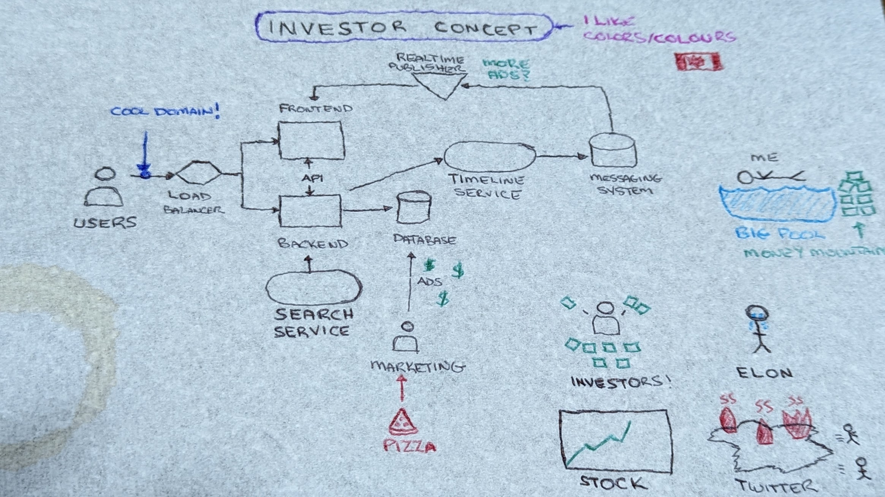
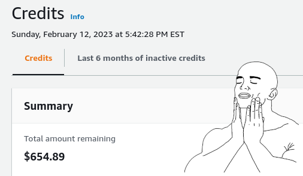
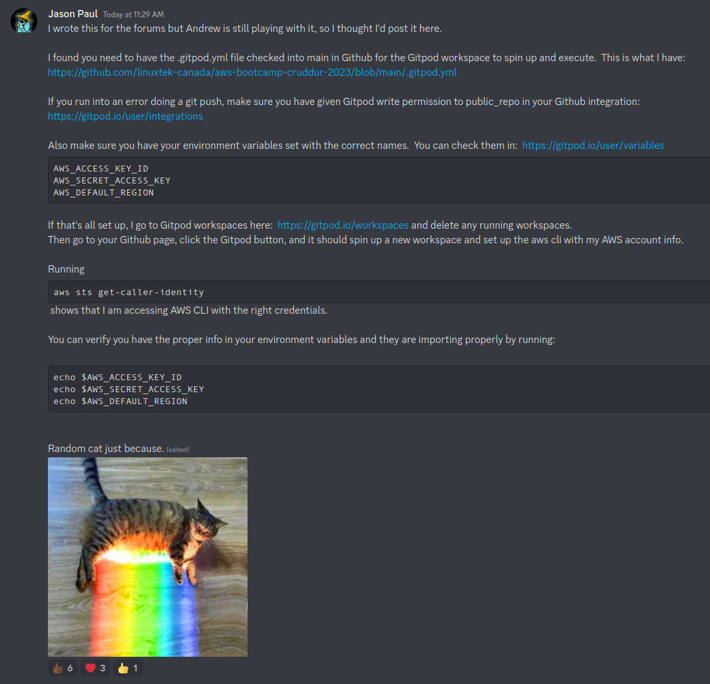
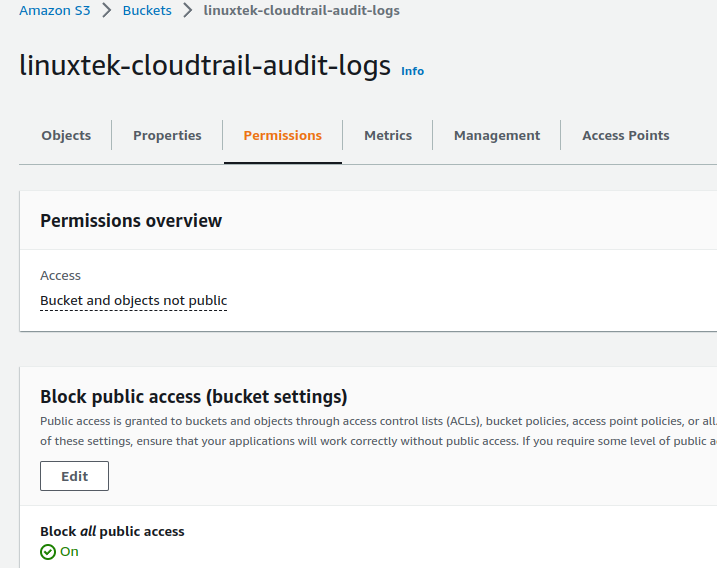

# Week 0 — Billing and Architecture


## Prerequisites
* Created AWS Account for Bootcamp.
* Created Github repo (which you are reading from).
* Set up Gitpod account authorized with Github.  Followed [Gifted Lane's Video](https://www.youtube.com/watch?v=yh9kz9Sh1T8) for setup, and [Andrew Brown's video](https://www.youtube.com/watch?v=A6_c-hJmehs) for the Gitpod button.


## Required Homework

1. Attended Week 0 Live Stream, and the Discord Q&A Session afterwards.
  * Watched follow-up Week 0 -  Generate Credentials, AWS CLI, Budget and Billing Alarm via CLI video.

2. Watched Chirag's Week 0 - Spend Considerations Video.

3. Watched Ashish's Week 0 - Security Considerations Video.
  * I had previously set up an AWS Organization and created the Bootcamp account as a subaccount.  I published [an article](https://www.linuxtek.ca/2023/02/07/aws-cloud-project-boot-camp-week-0-tips-and-tricks/) on this.
  * Activated MFA for root user.
  * Reviewed [blog post](https://aws.amazon.com/blogs/aws-cloud-financial-management/changes-to-aws-billing-cost-management-and-account-consoles-permissions/) for changes to IAM Policies.  Confirmed no affected policies to update.  

  

  * Developed AWS CLI commands to set up CloudTrail auditing on all AWS accounts in the organization (see under stretch homework).
  
4.  Created Conceptual Diagram in Lucid Charts AND on a Napkin (for fun)
  
  * So I found this [napkin diagram](../_docs/assets/week0/InvestorNapkinConcept.png) in a bar downtown.  It might have been left by one of the company executives... I think he doodled a bit on it after his meeting.



  * [Cruddur Conceptual Diagram Image](../_docs/assets/week0/CruddurConceptualDiagram.png).
  * [Link to Lucid.app Diagram Page](https://lucid.app/lucidchart/7b1529ce-a0a8-4286-9c06-b24db24e74b2/edit?viewport_loc=-709%2C-185%2C3072%2C1563%2C0_0&invitationId=inv_00523f1f-f0cb-42a0-9222-c5c55ec7500b).


5.  Finished architectural diagram:


  * [Cruddur Logical Architectural Diagram](../_docs/assets/week0/CruddurLogicalDiagram.png).  
  * [Link to Lucid.app Diagram](https://lucid.app/lucidchart/7c5f8bda-7f82-4968-a9fa-9c824462d257/edit?viewport_loc=507%2C60%2C3072%2C1563%2C0_0&invitationId=inv_b5f72136-14bb-482f-9478-a8d4f15e3e20).
  * Interesting to pull out the SVG file and have to edit it to get the color fill to work as per the video.  I was able to convert the [original](../_docs/assets/week0/momento_original.svg) inspected output to a [modified version](../_docs/assets/week0/momento.svg) as per the video, and got the exact color #25392B filled for the icon.  
  * I decided to add a few things to the entry point to help mitigate DDOS attacks.  Considering spend, [Amazon Cloudfront](https://aws.amazon.com/cloudfront/pricing/) is included in Free Tier, and could be handy to do some caching and delivery content.  Also, AWS Shield Standard to defend against DDOS attacks is included.  I also added [AWS Web Application Firewall](https://aws.amazon.com/waf/), focusing on the Bot Control feature, as you get 10 million common bot control requests per month within the AWS Free Tier.
  * If there was more spend allowed, I could look at using more advanced features, like [Web ACLs](https://docs.aws.amazon.com/waf/latest/developerguide/web-acl.html) to limit IPs by region or country, [perform rate limiting](https://docs.aws.amazon.com/waf/latest/developerguide/waf-rule-statement-type-rate-based.html) to prevent spamming the web frontend or API backend, and other guardrails.  

6.  Created IAM Admin user with unique login alias.  I use a [hosted Bitwarden server](https://www.linuxtek.ca/2023/01/03/self-hosting-bitwarden-on-aws/) to save all my passwords, and it includes a random password generator.

7.  Used AWS CloudShell in ca-central-1 region.  Yup, it works.


8.  Generated AWS Credentials - Access Key/Secret pair for cruddur-admin user.  Added persistent Gitpod variables to store AWS credentials for resuse using these commands:

```
gp env AWS_ACCESS_KEY_ID=""
gp env AWS_SECRET_ACCESS_KEY=""
gp env AWS_DEFAULT_REGION=""
```

9.  Installed AWS CLI for Gitpod using [this video](https://youtu.be/OdUnNuKylHg).  Manually installed, but also edited .gitpod.yml to auto-install if the environment gets restarted.

```
tasks:
  - name: aws-cli
    env:
      AWS_CLI_AUTO_PROMPT: on-partial
    init: |
      cd /workspace
      curl "https://awscli.amazonaws.com/awscli-exe-linux-x86_64.zip" -o "awscliv2.zip"
      unzip awscliv2.zip
      sudo ./aws/install
      cd $THEIA_WORKSPACE_ROOT
```

Confirmed in Gitpod [User Settings > Variables](https://gitpod.io/user/variables) that variables are saved:


Started up a new Gitpod environment to confirm AWS CLI was installed correctly and AWS credentials were pulled from Gitpod variables to environment variables.  Successfully ran ```aws sts get-caller-identity``` and returned values.

10.  Created a Billing Alarm (after Budget)

* [Used this document](https://docs.aws.amazon.com/AmazonCloudWatch/latest/monitoring/monitor_estimated_charges_with_cloudwatch.html) to set up a billing alarm using CloudWatch.
* Also [read this blog](https://aws.amazon.com/blogs/mt/setting-up-an-amazon-cloudwatch-billing-alarm-to-proactively-monitor-estimated-charges/) to better understand how the services communicate with each other to send alerts.

* Configured JSON file [here](../aws/json/aws-metric-alarm-config.json) with settings to breach alarm at $10 usage on one data point, and ran the following command in AWS CLI to set it up:

```
aws cloudwatch put-metric-alarm --cli-input-json file://aws-metric-alarm-config.json
```

This started to alarm almost right away, initially because of insufficient data, so I will wait to see if it addresses itself once data starts being tracked properly.

11.  Created a Budget

  * Used the JSON from [this article](https://awscli.amazonaws.com/v2/documentation/api/latest/reference/budgets/create-budget.html) to create a billing budget.  Stored a modified copy of it here.

  * I'm fortunate to have a lot of AWS credits from various sources including the AWS Community Builders Program, so I set the budget to $100 as I have plenty of credits to burn:

  

  These credits are in my root AWS account within my Organization, however based on [this article](https://docs.aws.amazon.com/awsaccountbilling/latest/aboutv2/useconsolidatedbilling-credits.html), credits are shared with all accounts that join an organization at any point in the month.  So there should be no issue with charges on this account, as it can draw from the AWS credits on the main account.

  I configured the JSON files in the aws/json directory and ran the following command to create the budget:

  ```
  aws budgets create-budget \
    --account-id $AWS_ACCOUNT_ID \
    --budget file://aws-budget.json \
    --notifications-with-subscribers file://aws-budget-notifications-with-subscribers.json
  ```

  * Note that I have the AWS Account ID set as an environment variable in Gitpod so it can automatically be retrieved on workspace launch, rather than hardcoding.  I set this up in Gitpod via CLI using:
  
  ```
  gp env AWS_ACCOUNT_ID=""
  ```

  * I also created an SNS topic as a billing alarm, to email me if the usage exceeds 80% of $100.  I ran the following to create a Topic ARN, and once it was generated, ran the next command to subscribe SNS to the billing alarm and to notify me when in alarm:

  ```
  aws sns create-topic --name billing-alarm

  aws sns subscribe \
    --topic-arn="<billing-alarm-arn>" \
    --protocol=email \
    --notification-endpoint=emailaddress@gmail.com
```

* I checked my email address, and confirmed the subscription so AWS will email me if the billing alarm goes off:


## Stretch Homework Efforts

* Added additional features to architectural diagram (explained above). Adding additional infrastructure on the Free Tier is within my skillset, and I'll try to add these features as we go along if possible.

* Napkin diagram 😂.

* Helping others in Discord.

* [Article](https://www.linuxtek.ca/2023/02/07/aws-cloud-project-boot-camp-week-0-tips-and-tricks/) with Week 0 Tips and Tricks, including how to set up the Github repo via template, and setting up an AWS organization.

* [Article](https://www.linuxtek.ca/2023/02/12/aws-cloud-project-bootcamp-week-0-unofficial-homework-guide/) to organize homework into unofficial guide.

* Forum post to help others (with motivational cat picture):


### Creating CloudTrail Auditing via AWS CLI

* Watched section of Ashish's video on creating auditing logs in CloudTrail again.  Reviewed [AWS CLI documentation](https://awscli.amazonaws.com/v2/documentation/api/latest/reference/cloudtrail/index.html) for CloudTrail on how to set up a CloudTrail via CLI, rather than ClickOps in the web console.  Used [create-trail](https://awscli.amazonaws.com/v2/documentation/api/latest/reference/cloudtrail/create-trail.html) command to create the CloudTrail auditing log on my main AWS account using the following:

* First I need to create a KMS key to encrypt the logs.  Based on [this documentation](https://awscli.amazonaws.com/v2/documentation/api/latest/reference/kms/index.html), I can execute a [create-key](https://awscli.amazonaws.com/v2/documentation/api/latest/reference/kms/create-key.html) command by running the following:

```
aws kms create-key \
  --multi-region \
  --description "KMS Key for CloudTrail Audit Log Encryption" \
  --tags TagKey="Name",TagValue="CloudTrail Audit KMS Key"
```

This outputs information on the KMS key, including the Key ID and ARN.  To add an alias for easy reading in the AWS Console, use the [create-alias](https://awscli.amazonaws.com/v2/documentation/api/latest/reference/workmail/create-alias.html) command.  For example:

```
aws kms create-alias \
  --alias-name "alias/CloudTrailAuditKey" \
  --target-key-id <kms key id>
```

Once this is done, Checking in the web console, we can see the key created:


Now in order for CloudTrail to use this KMS key for encryption, we have to add it to the key policy.  I used [this article](https://docs.aws.amazon.com/kms/latest/developerguide/key-policy-overview.html) as an example, and created an [aws-kms-cloudtrail-policy.json](../aws/json/aws-kms-cloudtrail-policy.json) file.  We can use the [put-key-policy](https://awscli.amazonaws.com/v2/documentation/api/latest/reference/kms/put-key-policy.html) command to attach the policy to the KMS Key as follows:

```
aws kms put-key-policy \
  --key-id <kms key id> \
  --policy-name default \
  --policy file://aws-kms-cloudtrail-policy.json \
  --output text
```

* Now that the KMS key is set up, we have to create the S3 bucket to use.  We can create the S3 bucket using the [create-bucket](https://awscli.amazonaws.com/v2/documentation/api/latest/reference/s3api/create-bucket.html) command:

```
aws s3api create-bucket \
  --bucket <s3 bucket name> \
  --region us-east-1
```

Going into S3, we can see the bucket created properly, but annoyingly public access is still enabled.  To fix this, I used [put-public-access-block](https://awscli.amazonaws.com/v2/documentation/api/latest/reference/s3api/put-public-access-block.html) to ensure no public access on this bucket:

```
aws s3api put-public-access-block \
  --bucket <s3 bucket name> \
  --public-access-block-configuration "BlockPublicAcls=true,IgnorePublicAcls=true,BlockPublicPolicy=true,RestrictPublicBuckets=true"
```
Now when going into the web console, we can see that under Permissions, public access enabled:



We also have to add a policy to the S3 bucket to allow CloudTrail to write to it.  [This article](https://docs.aws.amazon.com/awscloudtrail/latest/userguide/create-s3-bucket-policy-for-cloudtrail.html) had a helpful example of the policy.  We can use the [put-bucket-policy](https://awscli.amazonaws.com/v2/documentation/api/latest/reference/s3api/put-bucket-policy.html) command to do this.
Effectively, we need to allow CloudTrail to be able to write to this bucket.  I copied the JSON structure from another bucket, and edited it to use the correct ARN and service names, and uploaded it [here](../aws/json/aws-cloudtrail-s3-policy.json).  The command to attach the policy to the bucket would be:

```
aws s3api put-bucket-policy \
  --bucket linuxtek-cloudtrail-audit-logs \
  --policy file://aws-cloudtrail-s3-policy.json
```

Because we are setting up CloudTrail logging for all accounts in the organization, we first have to enable trusted service access using the following:

```
aws organizations enable-aws-service-access \
  --service-principal cloudtrail.amazonaws.com
```
Now that we have the KMS Key and the S3 bucket set up and permissioned, we can create the CloudTrail with the following:

```
aws cloudtrail create-trail --name aws-cloudtrail-auditlog \
  --s3-bucket-name <s3 bucket name> \
  --kms-key-id <kms key id> \
  --include-global-service-events \
  --is-multi-region-trail \
  --is-organization-trail \
  --tags-list Key="Name",Value="CloudTrail Audit Logging"
```
This should return all of the JSON details for the CloudTrail configuration.

Another annoying thing is that it does not start logging by default (yes, seriously).  This must be enabled manually, which can be done with the [start-logging](https://docs.aws.amazon.com/cli/latest/reference/cloudtrail/start-logging.html) command:

```
aws cloudtrail start-logging \
  --name aws-cloudtrail-auditlog
```

And now we can see that CloudTrail is logging to S3 successfully:


**Conclusion:**  Doing this via console is probably actually faster.  Or just write it in Terraform like your gut told you to.  Or just don't be so stubborn.  Still, was an interesting rabbit hole exercise and now we have the commands and policy.


